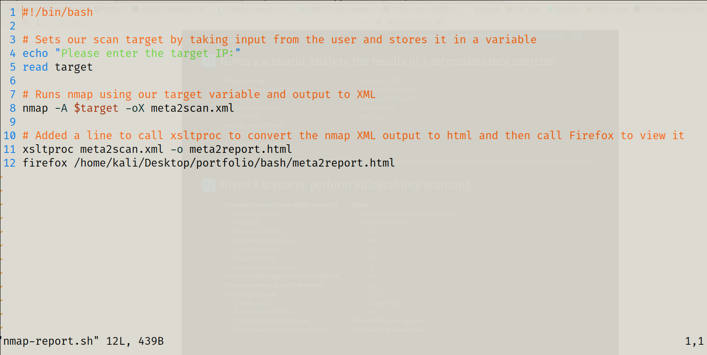

# Scenario
In this lab, I will utilize scripting basics to automate some pentest related tasks.

# Objectives
This activity is designed to test my understanding of and ability to apply content examples in the following CompTIA PenTest+ objectives:

5.1 Explain the basic concepts of scripting and software development.

# Walkthrough
### Automated Reporting in BASH
As I saw in the last couple of labs, scripting can help automate various tasks. For this section of the lab I will be going to create a simple script which will run an nmap scan of Metasploitable2 and then use a program called xsltproc to generate a nice HTML format report.

For the activities in this lab I will be using the Kali VM.

1. Let's start by creating our empty script file with the touch command.
```bash
# I created an empty script file with the touch command and I used nano as my text editor
touch nmap-report.sh
nano nmap-report.sh

# Added shebang line
#!/bin/bash

# Sets our scan target by taking input from the user and stores it in a variable
echo "Please enter the target IP:"
read target

# Runs nmap using our target variable and output to XML
nmap -A $target -oX meta2scan.xml

# Added a line to call xsltproc to convert the nmap XML output to html and then call Firefox to view it
xsltproc meta2scan.xml -o meta2report.html
firefox /root/meta2report.html
```
_The screenshot below is what my bash script looks like_



2. Before we can run our newly created script, we have to give it execute permissions on the Linux system.
```bash
# Used the chmod command to edit the script's permissions.
chmod 755 nmap-report.sh
```
3. Now to run the script, type ./nmap-report.sh and press ENTER.
```bash
# Be sure to be in the same directory as the bash script
./nmap-report.sh
```
_The screenshot below is what my report looks like_


# Reflections/Lessons Learned
As I can see this can be pretty powerful. There is so much more we could do with the script. For example, we could use the target variable in the naming of the output files so we would not have to hard code the filenames and they would be named based on whatever target we chose.

# Future Goals/Projects
Question - Can I make a bash script that scans the subnet and creates a file with a list of hosts found. It will then run a port scan on each of the hosts in the list. Will save port scan results to a text file.

Requirements:
1. Bash script
2. Scans subnet for hosts
3. Creates a list after locating a host
4. Appends each successive host found to the list until subnet scan is complete
5. Iterate over the list of hosts to scan for ports
6. Port Scan results will be saved to a text file
